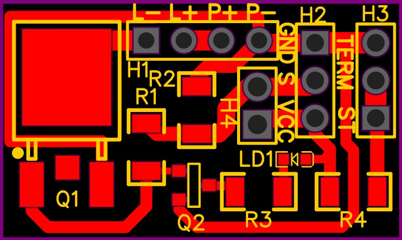
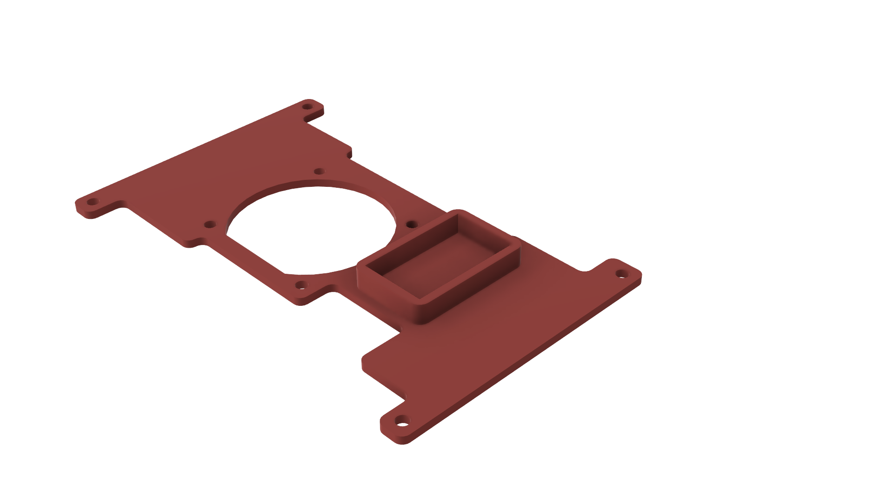

# Система охлаждения для платы DE10-Nano
## Создание печатной платы
Для проекта была разработана печатная плата, для удобного соединения всех компонентов. 

Размер печатной платы – 27х16 мм.


Проект был разработан в среде EasyEDA и находится [здесь](PCB_Layout.json).
### Перечень необходимых компонентов:
1. Q1 – транзистор IRLR8113 в корпусе DPAK.
2. Q2 – транзистор 2N7002 в корпусе SOT23.
3. R1 и R3 – резисторы сопротивлением 1 КОм в корпусе 1206.
4. R2 – резистор сопротивлением 10 КОм в корпусе 1206.
5. R4 – резистор сопротивлением 100 КОм в корпусе 1206.
6. TERM – термистор NTC 3950 100K.
7. LD1 – светодиод любого цвета типоразмера 1608.
8. Для площадки H1 требуются header male 1x4.
9. Для площадок H2 и H3 требуются header male 1x3.

### Подключение к плате DE10-Nano
Для правильной работы системы необходимо подключить все необходимы пины к плате:

1. Пин GND подключается к пину GND на плате.
2. Пин Vcc подключается к пину с питанием 3.3В на плате.
3. Пин S необходимо подключить к одну из пинов GPIO в зависимости от привязанного в проекте пина.
4. Пин ST необходимо подключить к одну из пинов ADC в зависимости от привязанного в проекте пина.
5. Пины L- и L+ необходимо подключить к вентилятору.
6. Пины P- и P+ необходимо подключить к источнику питания для вентилятора. Питание может быть подключено несколькими способами:
    1. Пин P+ подключается к пину 9В в разъемах Arduino. Пин P- можно не подключать, т.к. пин GND уже подключен к плате.
    2. Пин P+ подключается к питанию с напряжением до 24В. Пин P- необходимо подключить к GND источника питания.

## Сборка системы охлаждения

Специально для разработанной платы был разработана 3D модель крышки с удобным соединением с DE10-Nano, а также с вентилятором типоразмера 40х40 мм.


Скачать модель в формате stl для печати можно [здесь](Крышка.stl).

## Модуль управления охлаждением
В папке [Quartus_project](Quartus_project/) представлен проект с примером использования адаптивной системы охлаждения.
### Основные настройки
Ниже представлен пример подключения модуля охлаждения в проект.
```
cooling_system cs1(
    .min_temp(30),
    .max_temp(60),
    .cur_temp(analog[0]),    
    .fan_control(GPIO[0]),
    );
```
Для корректной работы необходимо подать правильные сигналы в каждый вход/выход модуля:
* В min_temp передается температура, до которой необходимо охлаждать плату в случае ее нагрева до max_temp.
* В max_temp передается максимально допустимая температура.
* В cur_temp необходимо передавать данные о текущей температуре с термистора. 
* В fan_control необходимо подключить один из пинов GPIO для управления включением/отключение вентилятора.

### Дополнительные настройки
Для дополнительной настройки кода, в том числе для использования с другими платами есть возможность дополнительной настройки модуля:

1. extra_res используется для задания сопротивления резистора R4 выступающего в качестве делителя напряжения для работы термистора.
2. voltage показывает напряжение, поданное на пин VCC. Данное значение должно быть целым и для этого реальное значение помножается на mult_voltage. Для питания 3.3В voltage = 33.
3. mult_voltage отображает на сколько домножено напряжение на VCC. Для питания 3.3В mult_voltage = 10.

### Использование примера
Для использования примера можно воспользоваться уже скомпилированной версией. Для этого нужно прошить плату с использованием [Quartus Prime Lite Edition 18.1](https://fpgasoftware.intel.com/18.1/?edition=lite&platform=windows) и файла [cooling.sof](Quartus_project/cooling.sof).


## Примечание
Инструкцию в формате Word можно скачать [здесь](Инструкция.docx).